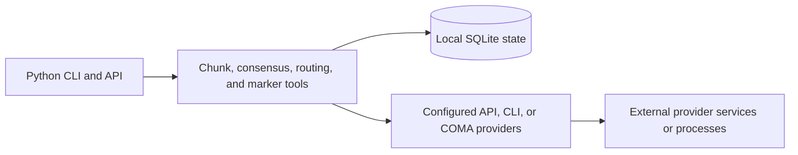
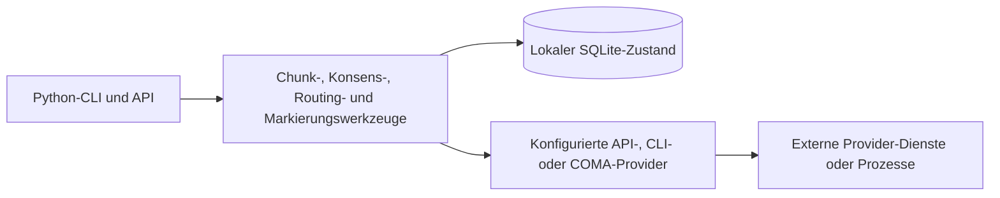

# Architecture and coordination boundaries

[English](#english) · [Deutsch](#deutsch)

## English

The public overview and install instructions are in [`README.md`](../README.md). This page describes the implementation boundaries in more detail.

The SQLite marker and chunk stores hold local coordination data. A provider call can transmit the prompt and request data needed for that call. There is no project-level no-egress guarantee.

### Patterns and limits

- `tools/translate_swarm.py` and `tools/summarize_chunks.py` split work into chunks, coordinate database claims, and write results to SQLite.
- `tools/consensus_swarm.py` collects independent results. Its `confidence` field is `winner_count / total_results`; its `agreement_ratio` uses valid answers only. Failed or invalid results can lower the former. A tie has no winner. Neither field is a calibrated probability.
- `tools/stigmergy_api.py` stores and queries markers in SQLite.
- `tools/runner.py` exposes Claude CLI execution and optional COMA provider integration.
- `tools/team_lock.py` creates claim files exclusively and stores separate attendance records. This helps cooperating processes coordinate; a process can bypass or alter ordinary claim files.
- Consensus, translation, and summarization use positive finite estimated-cost caps for live work. `ClaudeRunner` has an optional cap. These controls do not create a single hard limit across arbitrary providers; estimates can differ from final charges.

### Localization

The translation tool's content targets are German, English, Spanish, Chinese (Simplified), Japanese, and Russian. That list describes generated translation content, not UI localization. CLI help is partly English and partly German; the experimental Tk UI under `experiments/dungeon/marauders_map_gui.py` has German labels. The project does not claim a six-language user interface.

### Build and CI

`pyproject.toml` declares Python 3.10 or newer and `setuptools>=77.0.3`. GitHub Actions configures Ubuntu, Windows, and macOS jobs across Python 3.10–3.13. See the workflow for current status; repository documentation does not freeze a test count.

---

## Deutsch

Die öffentliche Übersicht und Installationsanleitung stehen in [`README_de.md`](../README_de.md). Diese Seite beschreibt die Grenzen der Implementierung genauer.

Die SQLite-Marker- und Chunk-Datenbanken speichern lokale Koordinationsdaten. Ein Provider-Aufruf kann den dafür nötigen Prompt und weitere Anfragedaten übermitteln. Das Projekt garantiert keinen netzwerkfreien Betrieb.

### Muster und Grenzen

- `tools/translate_swarm.py` und `tools/summarize_chunks.py` teilen Aufgaben in Chunks, koordinieren Datenbank-Claims und schreiben Ergebnisse nach SQLite.
- `tools/consensus_swarm.py` sammelt unabhängige Ergebnisse. Das Feld `confidence` ist `winner_count / total_results`; `agreement_ratio` berücksichtigt nur gültige Antworten. Fehlgeschlagene oder ungültige Ergebnisse können den ersten Wert senken. Bei Gleichstand gibt es keinen Gewinner. Keines der Felder ist eine kalibrierte Wahrscheinlichkeit.
- `tools/stigmergy_api.py` speichert und liest Marker in SQLite.
- `tools/runner.py` stellt die Claude-CLI-Ausführung und optionale COMA-Provider-Integration bereit.
- `tools/team_lock.py` legt Claim-Dateien exklusiv an und führt getrennte Anwesenheitseinträge. Das unterstützt die Koordination kooperierender Prozesse; gewöhnliche Claim-Dateien können ignoriert oder verändert werden.
- Konsens, Übersetzung und Zusammenfassung verwenden für Live-Abläufe positive, endliche Kostenschätzungsgrenzen. `ClaudeRunner` hat eine optionale Grenze. Diese Kontrollen bilden keine gemeinsame feste Grenze für beliebige Provider; Schätzungen können von der Abrechnung abweichen.

### Lokalisierung

Die Übersetzungsziele des Werkzeugs sind Deutsch, Englisch, Spanisch, vereinfachtes Chinesisch, Japanisch und Russisch. Diese Liste beschreibt erzeugte Übersetzungsinhalte und keine UI-Lokalisierung. Die CLI-Hilfe ist teils englisch und teils deutsch; die experimentelle Tk-Oberfläche unter `experiments/dungeon/marauders_map_gui.py` hat deutsche Beschriftungen. Das Projekt behauptet keine Benutzeroberfläche in sechs Sprachen.

### Build und CI

`pyproject.toml` verlangt Python 3.10 oder neuer und `setuptools>=77.0.3`. GitHub Actions konfiguriert Ubuntu-, Windows- und macOS-Jobs für Python 3.10–3.13. Den aktuellen Status zeigt der Workflow; die Projektdokumentation hält keine Testzahl fest.
